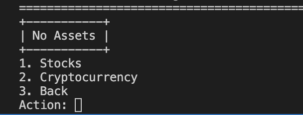

# Asset Organizer
#### Video Demo:  <URL HERE>
#### Description:
Overview:  
This program keeps track of assets namely (1) stocks and (2) cryptocurrencies. It aiming to provide a way to organize assets in a user-friendly Python program. The program allows the user to "buy" and "sell" assets, which provides a view on important information regarding the state of an asset such as; open, close, high, low, and volume to name a few. The program offers visual interactiveness using via a command-line user interface, and libraries for organizing visualization such as tables. 

  
  <em>image_caption</em>

The program has 3 main functions; (1) Navigation, (2) Data collection, and (3) Objects. Navigation refers to the usage of the user into different "windows" or "menu" of the program, choosing between stocks and cryptocurrencies, and the action (buy or sell) to be done. Once the user is in either of the windows and choosing an action, a prompt for a ticker will be displayed. A ticker is a unique symbol, represented by uppercase letters and often an abbreviation of the company, indicates a particular stock/cryptocurrency in the market (i.e. AAPL for Apple Inc, ETH for Ethereum). Upon inputting a valid ticker, the information of the associated stock/cryptocurrency will be displayed in a tabulated format. Web scraping is used to check the validity of a ticker, and for consequently obtaining relevant information. Finally, "buying" will create an instance of an stock or crypto object, representing the user's chosen purchase.  

Future improvements of the project include turning the Asset Organizer into a wallet, or a financial statement. This requires additional information such as liabilities, more assets, GUI, and tracking of time. 

Main Concepts:
* Web Scraping
* Object-oriented programming
* Testing
